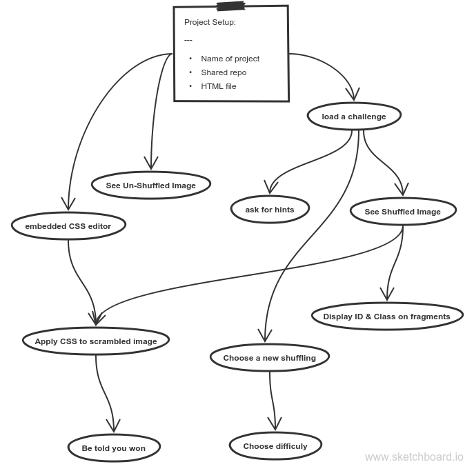

# FlexBox Puzzle

This will be a puzzle where developers learning Flexbox can practice their FlexBox skills.  They will be presented with a scrambled image and will be expected to unscramble it using FlexBox CSS properties.

### Index:
* [User Stories](#user-stories)
* [System Requirements](#system-requirements)
* [Story Dependencies](#story-dependencies)
* [Dev Schedule](#development-schedule)
* [Wireframe](#wireframe)
* [Notes](#notes)

---

## User Stories

A user can ...
* Solve the puzzle with CSS
* See the class & id for each image fragment
* See original 
* See un-shuffled image
* Undo back to original shuffle (delete your css)
* See image at all times
* Apply their CSS with a button
* Choose a new puzzle (multiple shufflings)
* Choose a different level 
* (ranked difficulty of multiple shufflings)
* Get a friendly message when they win
* Get hints when they ask

[TOP](#index)

---

## System Requirements

The system will ...
* Un-scrambling image and CSS will be in the same window
* The shuffled image will be updated when they ask for it
* Have a live CSS editor in the UI
* Class and ID info are displayed on shuffled image fragments

[TOP](#index)

---

## Wireframe

* [My wireframe](https://wireframe.cc/2sgv3U)

[TOP](#index)
___

## Development Dependencies

[TOP](#index)

---

## Development Schedule

First complete version:
0. Set-Up
1. See un-shuffled image
2. Embedded CSS editor
    1. Apply CSS to image (unscrambling)
    2. Be told you won
3. Load a challenge
    1. See shuffled image
    2. Display CSS ID & class

Coolering our game:
1. Choose a new shufling
    1. Choose shufflings by difficulty
2. Ask for hints

[TOP](#index)

---

## Notes

__Project Planning__:  
How long did it take to finish this, how long did you think it would take?

__Things I learned__:
*
*
*
*

__New vocab words__:
*
*
*
*

__Struggles I had__:
* 
*
*
*

__Plans for improving__:
* 
*
*
*

[TOP](#index)

___
___
### 
